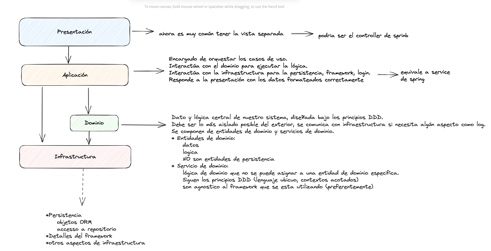

# ¿Que es domain driven design?

DDD es una metodologia que cubre el ciclo de vida del desarrollo de software, desde la toma de requerimientos hasta el diseño de bajo nivel, la premisa es construir un mejor software, para eso debemos alinear el diseño del dominio con las necesidades y estrategia de la empresa.

DDD propone alinear las preocupaciones empresariales y técnicas a traves del análisis del dominio, con esto podemos modelar el dominio del problema y ademas poder tomar desiciones de diseño de acuerdo con el modelo del dominio del problema, esto nos proporciona herramientas para tomar desiciones a 2 niveles: estrategica y tactica.

### Por donde comenzar

- Se piensa primero en el dominio del problema
	- es toda la lógica central relacionada con el área central del problema que vamos a solucionar sin considerar los casos de uso específico que queramos resolver
		- ej: una aplicación para mostrar marcador partido de fútbol, cuál es la lógica de dominio? acciones como comenzar el partido, finalizarlo, cambio de jugador, es toda la lógica inherente al dominio (partido de fútbol)
- El objetivo es ser experto en el dominio
- Se modelan todas las clases y entidades

#### Tiempo de desarrollo

- El dominio es invariable, no depende del problema, por ejemplo un partido de fútbol marcar gol siempre es lo mismo.
- Los caso de uso son mucho más inestable, tienden a cambiar con el tiempo y por la necesidades de los interesados

#### Lenguaje ubicuo

- Es importante tener un lenguaje "común" sobre el dominio en el que se está trabajando, esto nos permite estar alineados en las conversaciones y no generar malos entendidos, esto se conoce en DDD como lenguaje ubicuo
- Vocabulario común que describe el dominio del problema
	- verbos, nombres,adjetivos
- Es compartido por todos los interesados del proyecto.
- Se debe usar siempre para evitar malentendidos.
- El objetivo es utilizar el mismo lenguaje en todo los roles
- Se crea a partir de sesiones de brainstorming
- es parte del proceso iterativo
- Ubicuo "que está presente a un mismo tiempo en todas partes"
	- Se debe usar en conversaciones,emails, historias de usuario y codigo.

####  Contexto Acotados

- No se comparte entidades entre contexto si no que cada contexto tiene su propia entidad
- Un contexto acotado es aquel que tiene un sentido especial en el dominio
- Cada uno tiene su lenguaje ubicuo propio
- El tener definida la misma entidad en diferentes contextos no implica una duplicidad de código, si no una aclaración del mismo.
- Compartiendo modelo entre contextos, se tiende a acumular detalles e información de todos ellos, poniendo en riesgo la integridad del modelo.

#### Mapeo de contexto

Si bien es positivo separar nuestros modelos en contextos acotados, la lógica de un software complejo implica interacción entre los distintos contextos.
- Los contextos no son completamente independientes
- Debemos tener clara la interacción y dependencias entre los mismos.

En la imagen de arriba, tenemos distintos contexto que deben interactuar, entre la "primer linea" esta el contexto **upstream** (U) y **Downstream** (D), esto quiere decir que **upstream esta condicionando a downstream.**

## Arquitectura de capas de DDD

Importante: 
- Las flechas indican el flujo de la información, no la dependencia.
- Es importante que nuestro dominio sea lo mas estable de nuestra aplicacion, nunca se debe adaptar a la BBDD o al framework, en ese caso es mejor adaptar la capa de infraerstructura

Modelado de dominio

Ejemplo de scaffolding para un modelo de dominio:
dominio -> partido de tennis
tenisMatch -> clase core o de dominio, tiene los metodos para acceder o modificar las clases aggregate
player -> clase con informacion de los jugadores es una clase aggregate, que convive con el dominio
tenisSet -> clase con informacion de los set del partido es una clase aggregate, que convive con el dominio

### Aggregate
Un aggregate es una clase en si mismo que tiene su propio significado, pero que aún así, depende de un objeto de dominio

## SERVICIO DE DOMINIO

- Ejecuta lógica que no tiene cabida en ninguna de las entidades
- tiene logica que es parte del dominio (no sabe de base de datos ni de casos de uso)
- Son parte del dominio, no se crean de forma arbitraria*
	- se identifican en sesiones de brairstorming
- Acciones crud no tienen cabida en los servicios del dominio

Ej: si tenemos un dominio donde tenemos 2 modelos
- persona
- pais
por ejemplo si queremos calcular esperanza de vida, donde agregamos esa función ?
- en la entidad país no puede ser, no tiene sentido que un pais calcule la esperanza de vida de una persona
- en la entidad de persona tiene más sentido, pero violaremos el principio de responsabilidad unica, la entidad tendria demasiada responsabilidad
### Se crea un servicio que tenga esta logica

- DDD se centra en la importancia de entender bien el dominio de nuestro problema para crear buen software
- Para identificar los elementos del dominio se utiliza
	- Lenguaje obicuo, breainstorming
	- Identificación de contextos acotados
	- Mapeo de contextos
- Todo esto se hace con el fin de separar la lógica de la aplicación (casos de uso) de la lógica de dominio.
	- Los casos de uso varían mucho mas frecuentemente.
	- La logica de dominio no debiese variar mucho.
	- Tiene su origen en la arquitectura convencional de 3 capas, la capa de logica de negocio se divide en 2, capa de aplicación y dominio
- 

- Entidades -> son las clases principales
- Value object -> enum o interface todas las constantes que definan estructura
- Agreggate son clases secundarias, que aportan información o lógica a la clase principal
- Domain service -> es toda la logica que no tiene cabida en ninguna entidad o agreggate, puede ser lógica más especifica!